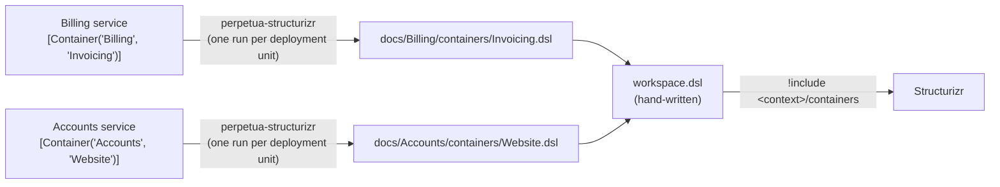

# Perpetua

[](https://github.com/SebaVDP/Perpetua/actions/workflows/ci.yml)
[](https://www.nuget.org/packages/Perpetua)
[](https://www.nuget.org/packages/Perpetua.Structurizr)
[](LICENSE)

Perpetua is a living-documentation platform: embed meaningful markers in your code and generate always-current documentation (C4/Structurizr, flows, onboarding).

## Install

```bash
dotnet add package Perpetua
dotnet tool install --global Perpetua.Structurizr
```

## Usage

### How it fits together



Each deployment unit is documented by its own run. The hand-written workspace brings the generated folders together.

### Example

Two deployment units, each marking its entry point with the container it represents:

```csharp
// Billing service
[Container("Billing", "Invoicing")]
public class InvoicingService { }

// Accounts service
[Container("Accounts", "Website")]
public class WebsiteHost { }
```

Run the tool once per deployment unit, passing the directory with its assemblies and, optionally, the output directory (both default to the current directory):

```bash
perpetua-structurizr ./billing/bin/Release/net10.0 ./docs
perpetua-structurizr ./accounts/bin/Release/net10.0 ./docs
```

The output directory now contains one folder per context:

```
docs/
├── Billing/
│   └── containers/
│       └── Invoicing.dsl      Invoicing = container "Invoicing"
└── Accounts/
    └── containers/
        └── Website.dsl        Website = container "Website"
```

Include the folders in a hand-written workspace. It uses `!identifiers hierarchical`, and the context must equal the identifier of the `softwareSystem` that includes its folder:

```
workspace {
    !identifiers hierarchical
    model {
        Billing = softwareSystem "Billing" {
            !include docs/Billing/containers
        }
        Accounts = softwareSystem "Accounts" {
            !include docs/Accounts/containers
        }
    }
}
```

Separate runs can therefore declare containers with the same name in different contexts.

### Rules

- A deployment unit declares **one** container. More than one fails the run and generates nothing; none generates nothing and succeeds.
- The context and the container name become a folder and a Structurizr identifier, so they may only contain letters, digits, `_` and `-`, and may not start with `-`. Anything else fails the run.
- Files from an earlier run with the same context and name are overwritten.

## License

[MIT](LICENSE)
